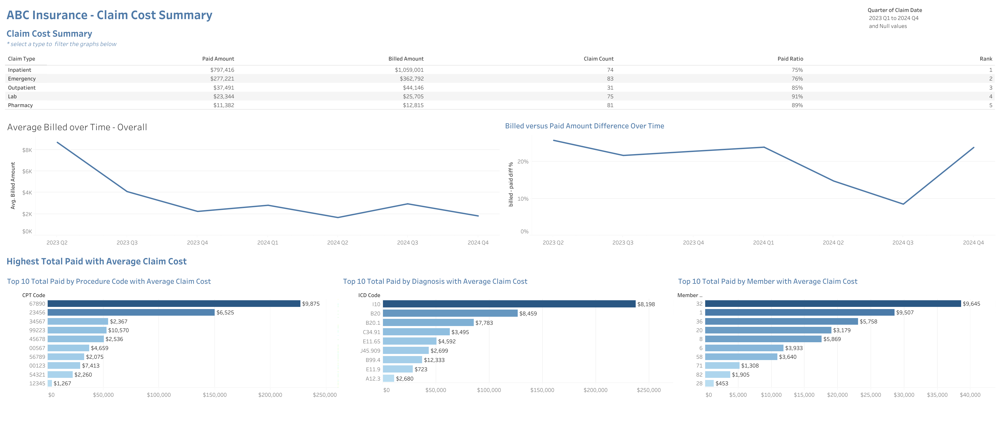
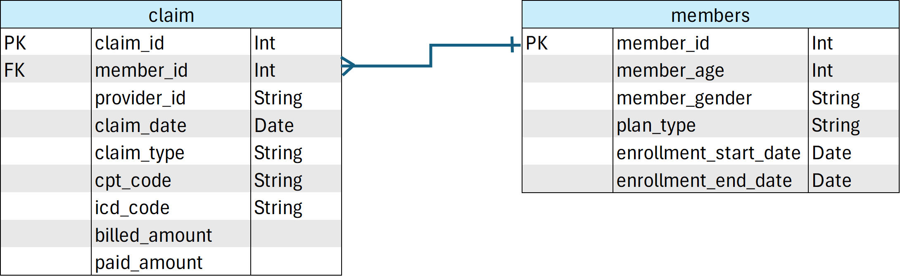
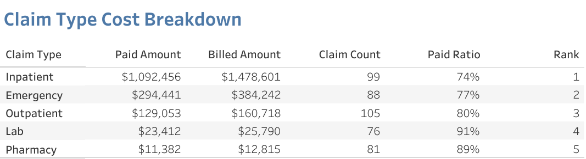
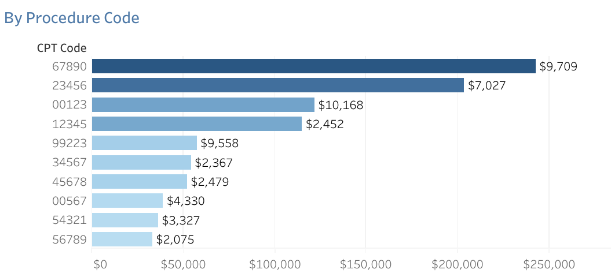
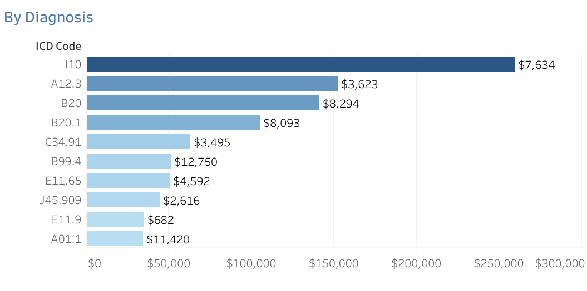
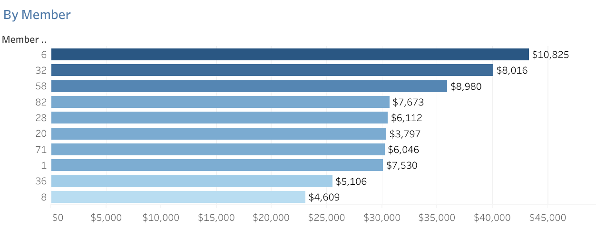
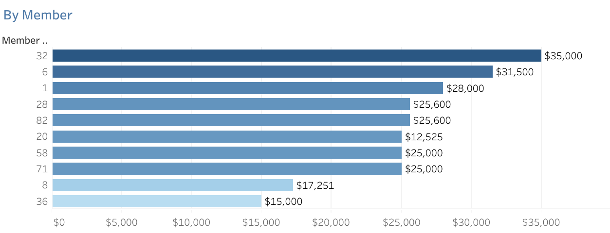
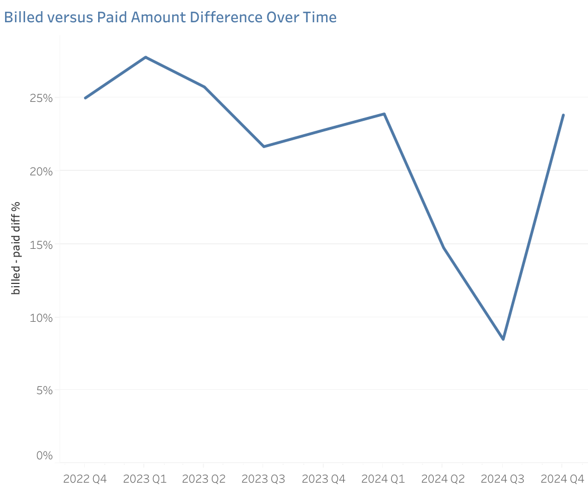

# Claim Cost Analysis
## Project overview
Executives at ABC Insurance request a dashboard to identify services, procedures, and members that drive the highest costs.

 ---
## Executive Summary
Although inpatient claims have the lowest paid ratio (74%), inpatient claims account for 70% of the total paid and are only 22% of the claims made. Excluding claims made prior to 2023, billed amounts (and also paid amounts) on inpatient claims exhibit the largest increase of all claim types. In comparison, lab claims have the highest paid ratio (91%), but only account for about 1% of the total paid on claims and 17% of the claims made. 

Below is the overview page from the Tableau dashboard and more examples are included throughout the report. The entire interactive dashboard can be found [here](https://public.tableau.com/views/ClaimAnalysis_17860550320940/Summary?:language=en-US&:sid=&:redirect=auth&:display_count=n&:origin=viz_share_link).

## Business Problem
Executives at ABC Insurance need a view of the data that will provides insight into costs that are driving down profits. The dashboard needs to provide cost information about claim types and high level details regarding procedures, diagnoses, and members related to cost.

## Objectives
Build a dashboard to answer C-Suite the following questions:
1. What claim types are the most expensive? 
2. Which CPT and ICD codes drive the highest spending?
3. Which members account for the largest share of total costs?
4. How do billed amounts compare to paid amounts?

## Repository Structure
| FILE | DESCRIPTION |
| --- | --- |
| claim_analysis.ipynb | Data cleaning and preprocessing |
| README.md | Project documentation |
| data/ | Original data files |
| images/ | Charts used in README |
| other/ | Other files used in analysis |

## Dataset
ABC's data structure consists of two csv files containing high level member and claim information with a total of 551 records. A description of each file is as follows:
* **Members**: high level information about each member, no personal information is revealed.
* **Claims**: basic information about each claim.

<strong>Entity Relationship Diagram (click to expand)</strong>
 

 

## Data Preparation
Data sets were imported into Python to assess cleanup needs. No missing or duplicated data was identified, and apparent date columns were converted to datetime data type. Nulls deemed ok for enrollment end date. Joined member and claims data sets. 

## Exploratory Data Analysis
* Grouped data by claim type and added a rank column. Created charts identifying the top 10 paid amounts by procedure code (CPT), diagnosis code (ICD), Member ID, and Plan Type.
* Created visuals for billed amount, difference between billed and paid amount, and number of claims over time to assess trends.
* Added calculations for paid ratio and visuals to rank paid ratio values by various categories like claim type, CPT code, ICD code, and provider. 
* Designed comparative visuals to familiarize users of combinations of diagnoses and procedures that generate the highest costs.

## Key Findings
**1. Most expensive claim types:**
* The lergest claim type segment based on paid amount is for inpatient claims, which accounts for 70% of all paid claim amounts. 
* Pharmacy and Lab claims are the smallest cost segments (comprising 1-2% of the total paid), but have the highest paid ratios (91 and 89% respectively).

    

**2. Procedure and Diagnosis codes with the highest spending:**
* The current top 5 procedure codes account for 48% of the total paid and 27% of all claims. 
* 4 of the top 10 procedure codes have average paid amounts greater than $5,000 per claim. If the dashboard is focused on Inpatient claims, the average paid amount for the top 10 codes jumps to $10,000.

    

* The current top 5 diagnosis codes account for 46% of the total paid and 28% of all claims. 
* Half of the top 10 diagnosis codes have average paid amounts greater than $5,000 per claim. If the dashboard is focued on Inpatient claims, 78% of the top 10 codes are above $10,000.

    

**3. Which members account for the largest share of total costs?**
* The 10 highest paid amount members account for 11% of the total number of claims, and 21% of total paid out to all members. These top 10 have an average claim of $6500. 
* ABC has insured 100 members historically and these members have 99 Inpatient claims, which have the highest average paid cost of all claim types. Only a few members have not had an inpatient claim.

    

* If we look at Inpatient claims only, per member total paid amount decreases by $10k, but the average paid per claim for these top 10 members jumps to $23k, which is only 2% of the total number of claims and 16% of the total paid. 
    

**4. How do billed amounts compare to paid amounts?**
* Although inpatient is the highest paid amount claim category, it also has the lowest paid ratio of 74%, which indicates existing effort to reduce paid amounts for these claim types. 
* Since 2023, billed appear to be fairly stable, however, the difference between billed and paid is also decreasing for the same time frame - ABC is paying more. If we include 2022 data, these values are to be trending down.

    

## Recommendations
* **Executives should assess the tool** and provide feedback on enhancements or modifications, if any. 
* **Efforts should be focused on inpatient claims.** Although tempting to start with highest paid ratios (in terms of claim type), reducing paid amounts for pharmacy and lab claims will not significantly reduce the costs to ABC. 

## Assumptions & Caveats
* Assumed all data was to be used in dashboard (no filters applied to view specific time periods)
* Assumed NULL end dates indicate member is a current policyholder and NOT bad data.
* Assumed all codes (CPT and ICD) are correct.
* Assessment assumed data provided represents all transactions for the claims listed and all paid amounts are finalized.Incomplete data may affect how the data should be viewed. 
* Note - claim data for 2024 is much lighter compared to 2023.

## Technologies Used
* Visual Studio, Python, Pandas, ZipFile, Tableau Public, GitHub, GitBash

## How to Reproduce
1. Download zip file from website
2. Run ipynb file
3. Upload data file to Tableau (create account if needed)
4. Create individual visuals
5. Create a date filter on a visual and apply to all visuals using the same data source.
6. Combine individual visuals into dashboards. 
7. Adjust headers as needed.
8. Add an action to filter the visuals on the dashboard based on selections made in the Claim Cost Summary table.

## Future Improvements
* Link dashboard to data sources (versus csv files) and establish a refresh schedule to update the dashboard. 
* Analysis to assess median ranges for procedures and diagnoses could be created, providing quick means to identify billed amounts that vary from the norm. 
* Based on feedback, the dashboard should be adjusted to meet the needs of the executives. Detailed views could be added to aid analysis for business segments users.
